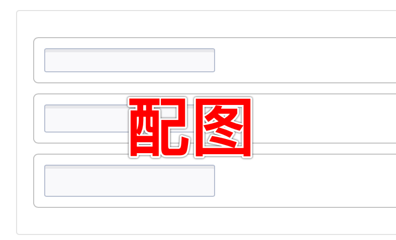
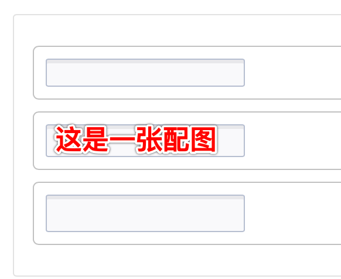

<!--副标题具体写法见源代码模式-->

## 简介

长文本输入框`textarea` 允许用户在多行中输入和编辑文本或数值，用于多行文本信息的输入。单行文本的输入，请使用[输入框]() `Input` 。

通常每个输入项都会搭配对应的标题，具体内容请参考[表单]() `Form` 。

## 基本构成

|      | 构成  | 可选  |描述                            |
| :--: | :-----| :--- |:------------------------------ |
|  1   | 主体输入框 | - |用于多行文本信息的输入  |

## 基本样式
### 状态
U-Design 的长文本输入框 `textarea` 具有5种状态：

1、默认

2、hover

2、获取焦点

3、报错

4、禁用

## 设计说明

### 避免使用占位符作为标题
避免使用占位符作为标题，因为一旦填写表单，占位符文本就会被覆盖。当占位符不再可见时，必须使用标签来指示表单字段的含义。

<!--配图分为左右两部分，左边是占位符作为标题，获取焦点后就看不到标题了，右侧是正常的-->

## 相关文档

1. [Input 输入框]()
2. [Form 表单]()
