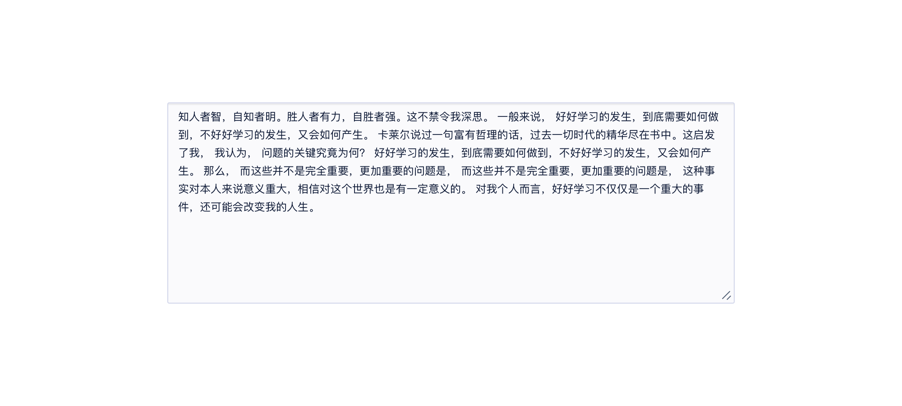
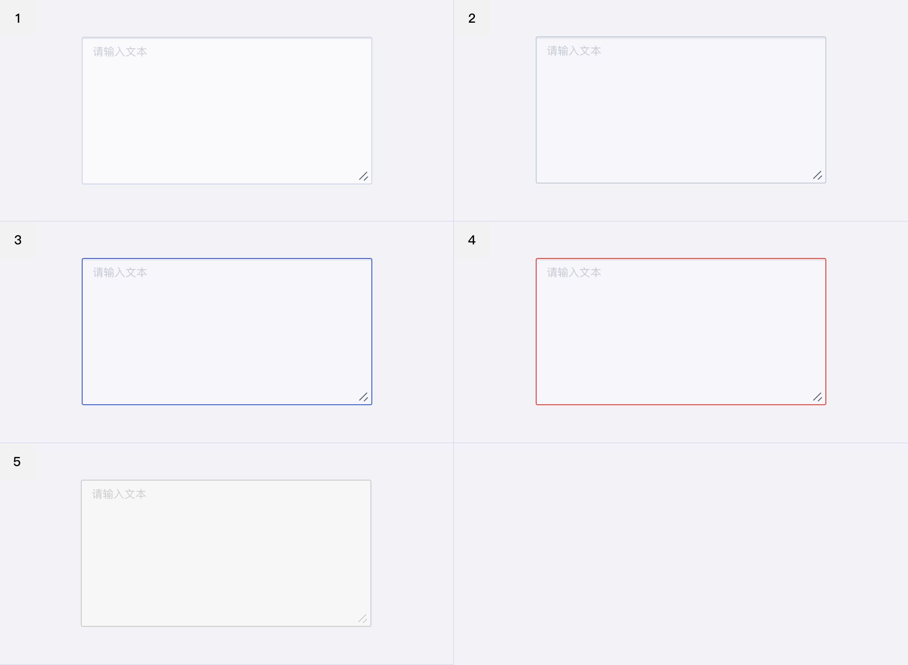
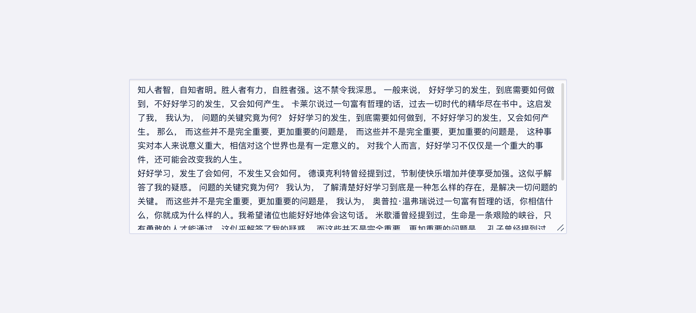

<!--副标题具体写法见源代码模式-->

## 简介

长文本输入框 `textarea` 允许用户输入或编辑多行文本或数值，用于多行文本信息的输入。

如果需要进行单行文本的输入，请使用 [输入框]()  `Input` 。

通常每个输入项都会搭配对应的标题，具体内容请参考 [表单]()  `Form` 。

## 基本构成

|      | 构成  | 可选  |描述                            |
| :--: | :-----| :--- |:------------------------------ |
|  1   | 主体输入框 | - |用于多行文本信息的输入  |

## 基本样式
### 状态
U-Design 的 长文本输入框 `textarea` 具有5种状态：

1、默认

2、hover

2、获取焦点

3、报错

4、禁用

## 设计说明

输入文本高度超过 长文本输入框 `textarea` 的默认高度时，会自动出现内容滚动条，并且用户可以通过拖动左下角来实现增加输入框高度的效果。

<!--

## 主题

| 内容 | 值           | 默认值  |
| :--- | :----------- | :------ |
| icon | icon/nothing | nothing |
| icon | icon/nothing | nothing |

-->

## 相关文档

1. [Input 输入框](/component/Input/)
2. [Form 表单](/component/Form/)
