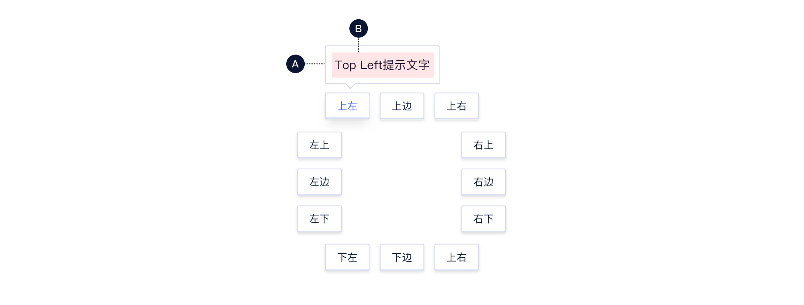
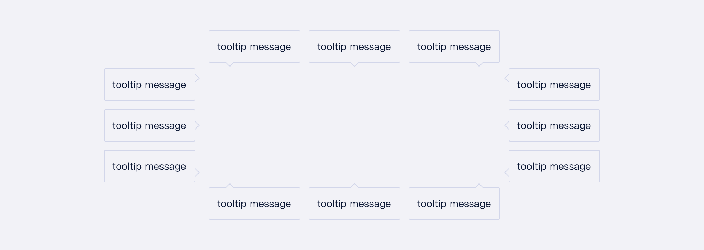
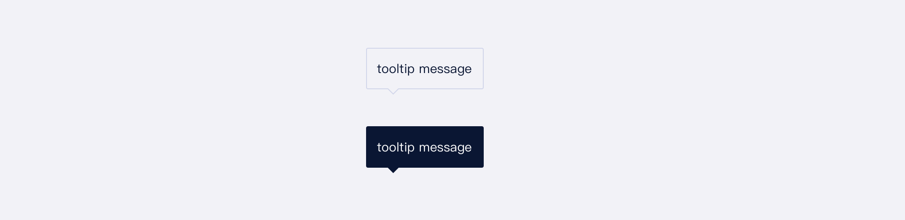
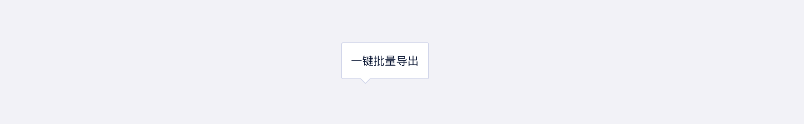
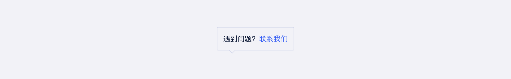

<!--副标题具体写法见源代码模式-->

## 简介

鼠标悬停于特定对象上触发的文字提示：

- 仅文本提示展示
- 带有**9个方向**的指向性箭头

## 基本构成

**A.箭头气泡框**

**B.文本**

## 基本样式
`Tooltip`支持9个方向箭头指向，使用时请确保始终指向目标元素。 

> 若目标元素周围有其他内容，注意避免遮挡。

### 颜色

U-Design预设了浅色、暗色两种颜色。

## 常见问题

### `Tooltip`与`Popover`分不清？

核心差异：提示内容是否包含操作。

`Popover`卡片面积更大，可容纳信息量更多；`Tooltip`仅用于纯文本提示场景，如需要增加操作，需使用`Popover`。

   

      
<i class="u-md-suggested"></i>纯文本提示

      
   

   

      
<i class="u-md-not-suggested"></i>包含操作，应使用Popover

     
   

<!--

## 主题

| 内容 | 值           | 默认值  |
| :--- | :----------- | :------ |
| icon | icon/nothing | nothing |
| icon | icon/nothing | nothing |

-->

## 相关文档

1. [Popover 气泡卡片](/component/Popover/)
