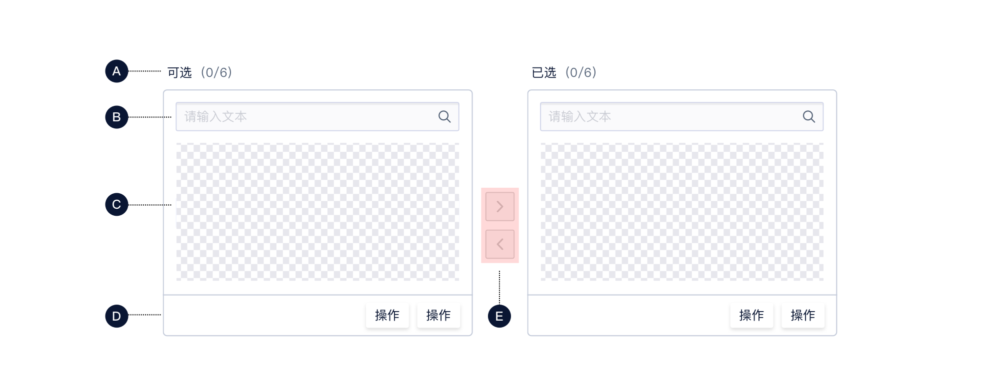
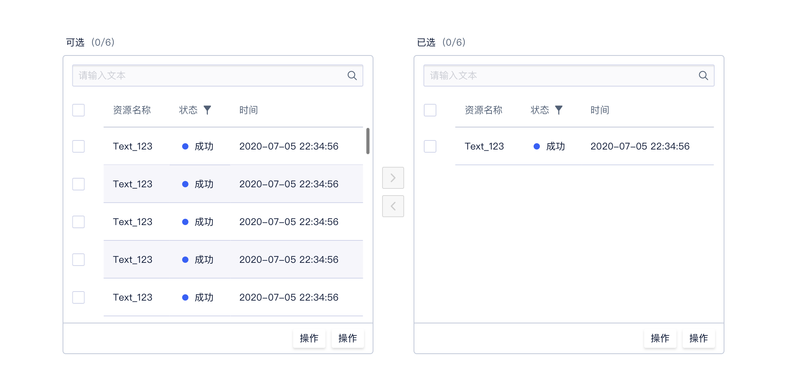
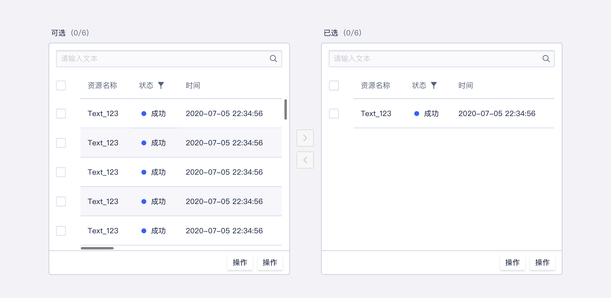

<!--副标题具体写法见源代码模式-->

## 简介

一种让用户用直观的方式在两栏中移动元素，完成选择行为的组件。

## 基本构成

| 顶部标题(A) | 搜索框（B） | 内容区域(C) | 底部操作(D) | 穿梭按钮(E) |
| :---------: | :---------: | :---------: | :---------: | :---------: |
|    可选     |    可选     |      ✓      |    可选     |      ✓      |

**A.顶部标题（可选）**

**B.搜索框（可选）**

输入的同时下方数据实时刷新。

**C.内容区域**

可配置单层级列表、含层级关系列表、表格。

**D.底部操作（可选）**

**E.穿梭按钮**

## 基本状态

## 设计说明

在界面中如何使用该组件？

#### 1.使用场景

-  当用户可能选择数量较多，需要进行校验时使用；
-  由于穿梭框占用空间较大，所以通常放于页面中或抽屉中使用。

#### 2.穿梭框与选择器的区别

- 选择器通常针对用户需要选择数量不多，校验成本较小的场景。
- 穿梭框通常则相反，用于需要选择数量较多，选择后需要对已选项进行仔细校验的场景。

## 常见问题

### 选择区内容

选择区域若使用表格，则不建议表头列数过多，从而出现横向滚动条影响体验。

   

      
<i class="u-md-suggested"></i>表头列数不宜过多，不会出现横向滚动条。

      
   

   

      
<i class="u-md-not-suggested"></i>若表头数量过多出现横向滚动条不利于用户操作。

      
   

