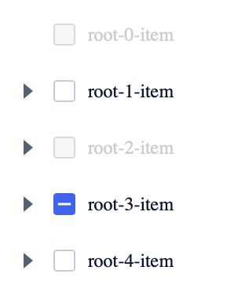

<!--副标题具体写法见源代码模式1-->

## 简介

\- 使用 树组件 可以完整展现信息间的层级关系，并具有展开、收起、选择等交互功能

\- 主要在 多级操作 和 多级选择 的时候使用该组件

\- 树组件支持对 层级结构 和 树结构 的数据进行操作

## 基本构成

1、节点展开折叠按钮

2、节点描述

3、复选框（可选）

## 基本样式
### 基础用法

选择，禁用，默认展开等功能。

## 设计说明
#### 1.悬停
实时的反馈能够让用户更好地使用系统，在 tree 的悬停效果上，U-Design 采取了整行背景高亮的形式，给予用户积极的反馈。

#### 2.默认项
在实际场景中，可以根据业务需求，将 Tree 的某些节点设置为默认展开或默认选中。

#### 3.禁用
可将 Tree 的某些节点设置为禁用状态，需要注意的是，如果被禁用项有子节点，则节点展开折叠按钮要能够正常使用。

#### 4.异步加载
如果遇到子节点信息量较大，加载时间较长等场景，建议采用异步加载的形式，点击「节点展开折叠按钮」展开节点，动态加载数据。异步加载需注意无法使用多选场景，多选时数据未加载无法获取选中数据。

## 相关文档

1. [相关文档1](https://www.ucloud.cn)
2. [相关文档2](https://www.ucloud.cn)
