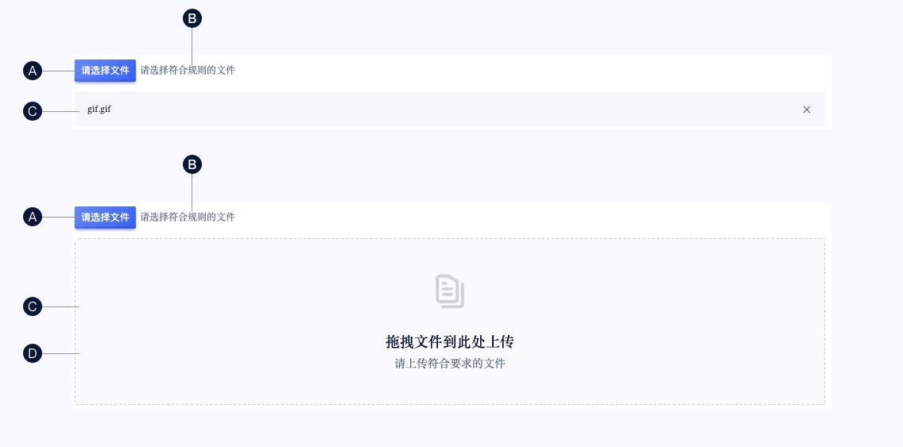
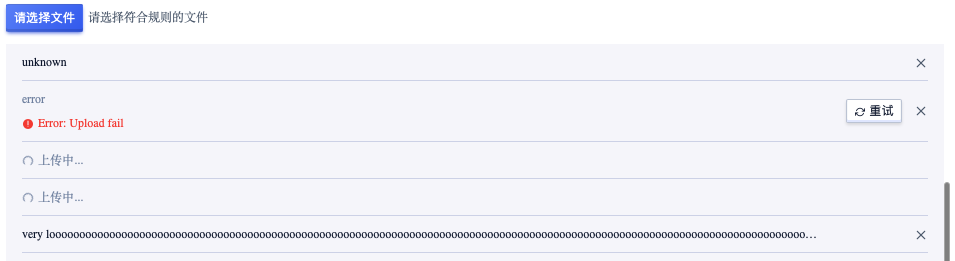
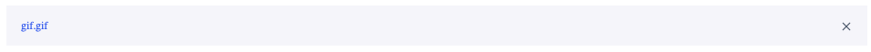
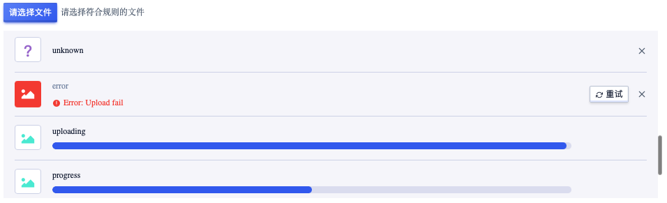
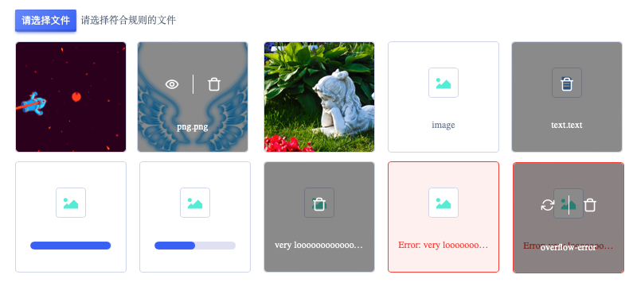
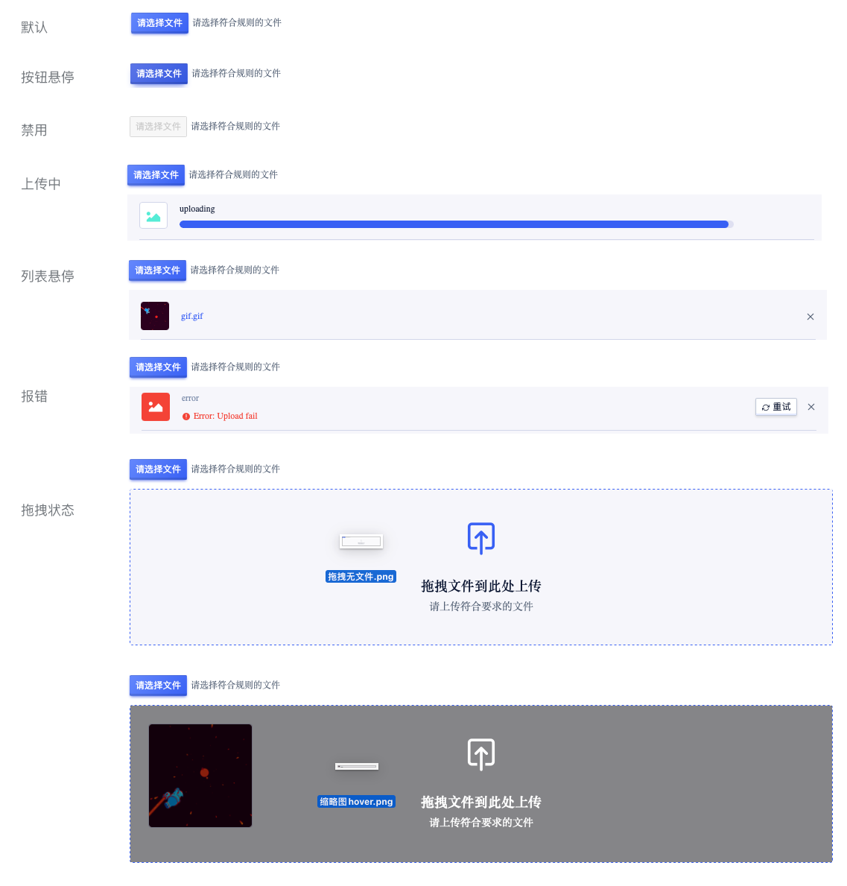

<!--副标题具体写法见源代码模式-->

## 简介

上传，通过点击或者拖拽上传文件。一般用于用户根据提示将自己本地的相应信息(包含本地和云储存)上传到网站，上传组件可以帮助用户对上传过程和上传结果有预期，并可以更改或撤销上传行为。

## 基本构成

|      | 类型     | 上传按钮(A) | 提示文本(B) | 已上传列表 | 拖拽上传区(D) |
| :--: | :------- | :---------: | :---------: | :--------: | :-----------: |
|  1   | 点击上传 |      ✓      |    可选     |     ✓      |      无       |
|  2   | 拖拽上传 |    可选     |    可选     |     ✓      |       ✓       |

## 基本样式

### 上传类型

上传类型根据使用操作，分为点击上传和拖拽上传。

| 类型               |                                                        |
| :----------------- | :----------------------------------------------------- |
| 点击上传 `primary` | 操作区域内最重要行动点，建议一个操作区域仅一个主要按钮 |
| 拖拽上传 `border`  | 支持拖拽文件到指定区域触发上传                         |

#### 点击上传

（包含状态：初始、上传过程、上传成功、上传失败、悬停、禁用状态）

文本列表

缩略图列表

卡片

#### 拖拽上传

（包含状态：初始、拖拽、上传过程、上传成功、上传失败、悬停、禁用）

## 基本状态

|      | 状态     | 说明                                                         |
| ---- | :------- | :----------------------------------------------------------- |
| 1    | 默认     | 默认初始状态                                                 |
| 2    | 按钮悬停 | 鼠标经过按钮时，切换至该状态                                 |
| 3    | 禁用     | 当前行动点不可用，建议配合提示说明                           |
| 4    | 上传中   | 展现上传进度和状态                                           |
| 5    | 列表悬停 | gif、png等格式的图可点击查看，鼠标悬停文件时的反馈状态       |
| 6    | 报错     | 当数据由于网络问题、接口问题等情况无法正常上传时，给予用户明确提示 |
| 7    | 拖拽状态 | 当使用拖拽上传时，鼠标拖拽文件至上传区的反馈                 |
